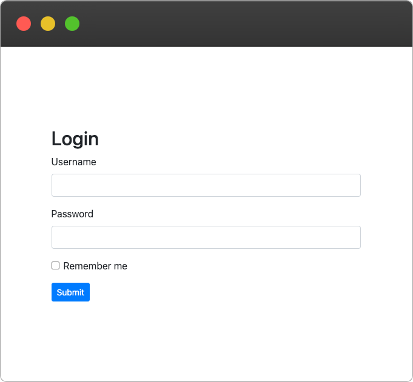
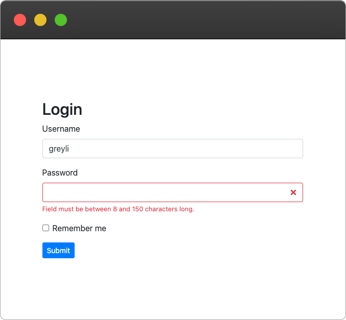

# Bootstrap-Flask


[](https://pypi.org/project/bootstrap-flask/)
[](https://github.com/greyli/bootstrap-flask/actions)
[](https://coveralls.io/github/greyli/bootstrap-flask?branch=master)

Bootstrap-Flask is a collection of Jinja macros for Bootstrap and Flask. It helps you to
render Flask-related data and objects to Bootstrap markup HTML more easily:

- Render Flask-WTF/WTForms form object to Bootstrap Form.
- Render data objects (dict or class objects) to Bootstrap Table.
- Render Flask-SQLAlchemy `Pagination` object to Bootstrap Pagination.
- etc.

It currently only supports Bootstrap 4, while the Bootstrap 5 support is
[on the way](https://github.com/greyli/bootstrap-flask/issues/162).


## Installation

```
$ pip install bootstrap-flask
```

## Example

Register the extension:

```python
from flask import Flask
# To follow the naming rule of Flask extension, although
# this project's name is Bootstrap-Flask, the actual package
# installed is named `flask_bootstrap`.
from flask_bootstrap import Bootstrap

app = Flask(__name__)
bootstrap = Bootstrap(app)
```

Assuming you have a Flask-WTF form like this:

```python
class LoginForm(FlaskForm):
    username = StringField('Username', validators=[DataRequired(), Length(1, 20)])
    password = PasswordField('Password', validators=[DataRequired(), Length(8, 150)])
    remember = BooleanField('Remember me')
    submit = SubmitField()
```

Now with the `render_form` macro:

```html

<html>
<head>
<!-- Bootstrap CSS -->
</head>
<body>

<h2>Login</h2>
{{ render_form(form) }}

<!-- Bootstrap JS -->
</body>
</html>
```

You will get a form like this with only one line code (i.e. `{{ render_form(form) }}`):



When the validation fails, the error messages will be rendered with proper style:



Read the [Basic Usage](https://bootstrap-flask.readthedocs.io/en/stable/basic.html) 
docs for more details.


## Migration from Flask-Bootstrap

If you come from Flask-Bootstrap, check out
[this tutorial](https://bootstrap-flask.readthedocs.io/en/stable/migrate.html) on how to
migrate to this extension.


## Links

- [Documentation](https://bootstrap-flask.readthedocs.io)
- [Example Application](https://github.com/greyli/bootstrap-flask/tree/master/examples)
- [PyPI Releases](https://pypi.org/project/Bootstrap-Flask/)
- [Changelog](https://github.com/greyli/bootstrap-flask/blob/master/CHANGES.rst)


## License

This project is licensed under the MIT License (see the
`LICENSE` file for details).
